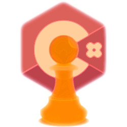

<br/>
<p align="center">
  <a href="https://github.com/minusSight/PawnCSharp">
    
  </a>

  <h3 align="center">PawnCSharp</h3>

  <p align="center">
    Pawn language implementation in C#
    <br/>
    <br/>
  </p>
</p>

    

### Installation (Unity)

1. Extract archive to any folder

2. All files from <b>"Plugins"</b> folder put into <b>"Assets/Plugins/"</b>

3. All files from <b>"AMX"</b> folder put into <b>"Assets/Scripts/"</b>

### Installation (Visual Studio)

1. Extract archive to solution folder

2. Add link to <b>"Plugins/PawnCSW.dll"</b>

### Example (Unity)

```CS
public AMX amx;

    static Native[] natives = new Native[]
    {
        new Native("log", Log),
        new Native("ShowDialog", ShowDialog),
        new Native("Quit", Quit)
    };

    #region Natives
    public static int Log()
    {
        Native native = Native.GetNative(natives, Log);
        string message = native.GetString(0);
        Debug.Log(message);
        return 0;
    }

    public static int Quit()
    {
        Native native = Native.GetNative(natives, Quit);
        Application.Quit();
        return 0;
    }

    public static int ShowDialog()
    {
        Native native = Native.GetNative(natives, ShowDialog);
        int dialogid = native.GetInt(0);
        int style = native.GetInt(1);
        string header = native.GetString(2);
        string info = native.GetString(3);
        string button1 = native.GetString(4);
        string button2 = native.GetString(5);
        UIController.Instance.ShowDialog(dialogid, style, header, info, button1, button2);
        return 0;
    }
    #endregion

    #region Callbacks
    public void OnGameStart()
    {
        Callback callback = amx.FindCallback("OnGameStart");
        if (callback != null) callback.Execute();
    }

    public void OnDialogResponse(int dialogid, int response, string inputtext)
    {
        Callback callback = amx.FindCallback("OnDialogResponse");
        if (callback != null)
        {
            callback.AddString(inputtext);
            callback.AddInt(response);
            callback.AddInt(dialogid);
            
            callback.Execute();
        }
        
    }

    #endregion
    void Awake()
    {
        amx = new AMX();
        amx.LoadFromFile(Application.streamingAssetsPath + "/csharp.amx");
        amx.SetNatives(natives);
        amx.Execute();
        OnGameStart();
    }

    private void OnApplicationQuit()
    {
        amx.Free();
    }
```

## License

Distributed under the MIT License. See [LICENSE](https://github.com/minusSight/PawnCSharp/blob/main/LICENSE.md) for more information.
