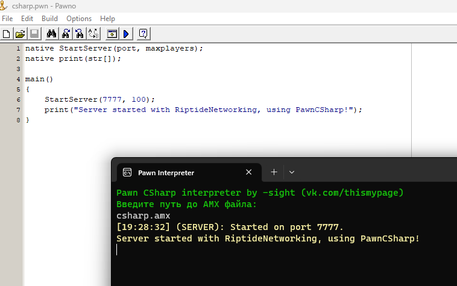

 

  

  <h3 align="center">PawnCSharp</h3>

  

    Pawn Language implementation in C#
     
     
    <a href="https://github.com/minusSight/PawnCSharp">View Demo</a>
    .
    <a href="https://github.com/minusSight/PawnCSharp/issues">Report Bug</a>
    .
    <a href="https://github.com/minusSight/PawnCSharp/issues">Request Feature</a>
  

    

## About The Project

Example: Starting <a href="https://github.com/minusSight/PawnCSharp/issues">RiptideNetworking</a> server using PawnCSharp
